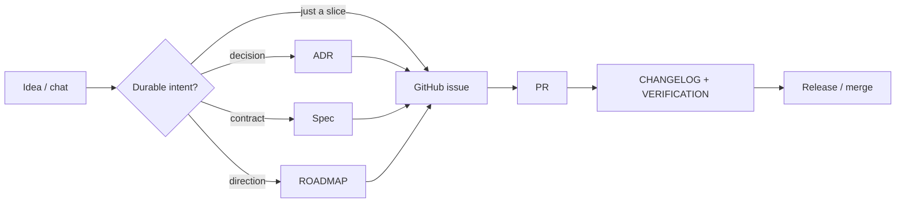

# Governance Workflow (Human Front Door)

A one-screen guide to how ideas, decisions, plans, and code move through this
repository. For the deep version see
[`docs/ADR/ADR-0003-artifact-maturity-model.md`](../ADR/ADR-0003-artifact-maturity-model.md)
and
[`docs/specs/artifact-maintenance-workflow.md`](../specs/artifact-maintenance-workflow.md).

## Two Distribution Models (Coexistence)

This repo ships agent skills through **two coexisting models** — know which one your
change belongs to:

- **Cursor-era registry** (ADR-0001..0005): `skill-registry.json` /
  `cursor-pack-registry.json` cataloguing `skills/<name>/` and `packs/<name>/`,
  deployed by `skill-sync.sh` / `cursor-pack-sync.sh`.
- **Claude-first plugin marketplace** (ADR-0006): `.claude-plugin/marketplace.json`
  cataloguing `plugins/<plugin>/`, installed natively via
  `/plugin marketplace add felipeblassioli/agent-skills` +
  `/plugin install <plugin>@agent-skills`. Governed by
  [`docs/marketplace-governance.md`](../marketplace-governance.md) and released by the
  plugins-only `release-skill.yaml` / `release-plugin.yaml` workflows.

**Rule of thumb:** a new Claude-installable plugin → the marketplace (`plugins/*`,
ADR-0006); anything already under `skills/` or `packs/` → the registry. The two do
not overlap — see the boundary table in
[`ADR-0006`](../ADR/ADR-0006-adopt-claude-first-plugin-marketplace.md).

## The Four Layers

| Layer | Where | Answers | Stability |
|---|---|---|---|
| **ADR** | `docs/ADR/ADR-NNNN-*.md` | What did we decide and why? | Durable; immutable once accepted |
| **Spec** | `docs/specs/*.md`, `scripts/<tool>/SPEC.md`, pack-level docs | What is this artifact contractually supposed to do? | Durable; versionable |
| **ROADMAP** | `packs/<pack>/ROADMAP.md` (per pack — no repo-level one) | What is the next direction for this artifact? | Living |
| **GitHub issue** | `felipeblassioli/agent-skills` | What is the next concrete implementation slice? | Execution unit |

Plus **`CHANGELOG.md`** (release history) and pack-level **`VERIFICATION.md`**
(release evidence).

## The Flow

**Rule:** durable intent (ADR / spec / ROADMAP) is written **before or
alongside** the issue, not after. The issue tracks execution; the durable doc
tracks meaning.

## The Maturity Ladder (ADR-0003)

Every artifact is classified L0–L3. The level determines required maintenance.

| Level | When | Minimum required |
|---|---|---|
| **L0** Experimental | Scratch, intake, spikes | Local purpose only; no release promise |
| **L1** Usable | Personal-use, stable entrypoint | Type-required manifest files (e.g. `SKILL.md` + `metadata.json` for skills; `pack.json` for packs) |
| **L2** Maintained | Recurring use, stable behavior, tool-like | Durable behavior contract (SPEC.md / README), tests or verification notes, linked backlog |
| **L3** Released/Critical | Registry-managed pack, safety-sensitive, broadly reused | Full release artifacts: `CHANGELOG.md`, `VERIFICATION.md`, `RELEASE-POLICY.md`, `ROADMAP.md`; `cursor-pack-verify.sh`; change gates |

Defaults: registry-managed Cursor Packs are L3; tool-like scripts are L2; most
root skills are L1–L2.

## Where Does X Go?

| You want to... | Put it in |
|---|---|
| Make a binding architectural decision | new ADR under `docs/ADR/` |
| Define how a tool, exporter, or workflow behaves | spec under `docs/specs/` or `scripts/<tool>/SPEC.md` |
| Capture future direction for a specific pack | that pack's `ROADMAP.md` |
| Capture future direction across the repo | open ADR or open GitHub issue (there is no repo-level ROADMAP) |
| Track a concrete implementation slice | GitHub issue on `felipeblassioli/agent-skills` |
| Record what shipped in a release | `CHANGELOG.md` (root, pack, or skill as appropriate) |
| Record release evidence for an L3 pack | that pack's `VERIFICATION.md` |
| Add agent routing for a behavior | `AGENTS.md` (root-level routing) or a Cursor rule under `.cursor/rules/` |

## The Loop (Step by Step)

For any non-trivial change:

1. **Classify** the artifact (type + maturity level).
2. **Read** the routing docs for that type: ADR-0002 for skills, ADR-0003 for
   everything, the matching `docs/specs/*.md`, the artifact's own
   SPEC/README/ROADMAP.
3. **Update the durable contract first** when maturity ≥ L2 and behavior is
   changing. ADRs for decisions; specs for contracts; ROADMAP for direction.
4. **Open a GitHub issue** for the concrete slice. Link it from the spec or
   ROADMAP if it shapes direction.
5. **Implement** with a focused PR. Run level-appropriate verification (tests,
   dry runs, `scripts/cursor-pack-verify.sh`).
6. **Update `CHANGELOG.md` / `VERIFICATION.md`** on release.
7. **Close the issue from the PR** with validation evidence.

Commit-scope rules ([`.cursor/rules/10-commit-conventions.mdc`](../../.cursor/rules/10-commit-conventions.mdc))
keep skill content, registry/scripts, and build tooling in separate commits.
PRs target `felipeblassioli/agent-skills` only
([`.cursor/rules/31-pr-target-guard.mdc`](../../.cursor/rules/31-pr-target-guard.mdc)).

## Worked Example: ADR-0004 + Claude Plugin Export

The cross-runtime packaging work in May 2026 followed this loop end to end:

1. **Decision** → [`docs/ADR/ADR-0004-cross-runtime-agent-packaging-model.md`](../ADR/ADR-0004-cross-runtime-agent-packaging-model.md)
   captures *why* packs remain canonical and plugins are export adapters.
2. **Contract** → [`docs/specs/claude-plugin-export-from-packs.md`](../specs/claude-plugin-export-from-packs.md)
   defines *what* the first adapter does. Marked **L0 (experimental)** with an
   explicit L0→L1 promotion gate.
3. **Slices** → six issues (#85–#90): schema discriminator, orphan cleanup,
   model mapping, readonly translation, verifier script, public distribution
   surface. Each links back to the ADR or spec.
4. **Execution** → PRs against each issue, with CHANGELOG entries when
   behavior ships. `VERIFICATION.md` evidence will record the L0→L1
   promotion when the verification workflow in the spec passes against a real
   pack.

This is the canonical pattern. Copy it.

## Known Gaps (As Of 2026-05-19)

- All four ADRs are still `status: draft`. The `proposed` / `accepted`
  lifecycle in [`docs/ADR/README.md`](../ADR/README.md) is documented but
  unused. Flip them or remove the lifecycle.
- No repo-level `ROADMAP.md`. Cross-cutting direction lives in ADRs and open
  issues. If repo-wide planning grows past what ADRs can carry, that's a gap
  worth filling.
- No CI enforcement of the maturity rules. The workflow lives in agent
  guidance and reviewer discipline.

## Deep Dives

- [`docs/ADR/ADR-0001-registry-driven-releases-for-skills-and-packs.md`](../ADR/ADR-0001-registry-driven-releases-for-skills-and-packs.md)
- [`docs/ADR/ADR-0002-governed-skill-maintenance-model.md`](../ADR/ADR-0002-governed-skill-maintenance-model.md)
- [`docs/ADR/ADR-0003-artifact-maturity-model.md`](../ADR/ADR-0003-artifact-maturity-model.md)
- [`docs/ADR/ADR-0004-cross-runtime-agent-packaging-model.md`](../ADR/ADR-0004-cross-runtime-agent-packaging-model.md)
- [`docs/ADR/ADR-0006-adopt-claude-first-plugin-marketplace.md`](../ADR/ADR-0006-adopt-claude-first-plugin-marketplace.md)
- [`docs/ADR/ADR-0007-skill-studio-plugin-canonical.md`](../ADR/ADR-0007-skill-studio-plugin-canonical.md)
- [`docs/marketplace-governance.md`](../marketplace-governance.md) — Claude-first plugin marketplace
- [`docs/specs/artifact-maintenance-workflow.md`](../specs/artifact-maintenance-workflow.md)
- [`docs/specs/cursor-pack-specification.md`](../specs/cursor-pack-specification.md)
- [`docs/specs/agentic-skill-pack-authoring.md`](../specs/agentic-skill-pack-authoring.md)
- [`docs/cursor-packs.md`](../cursor-packs.md) — pack catalog
- [`docs/agents.md`](../agents.md) — agent catalog
