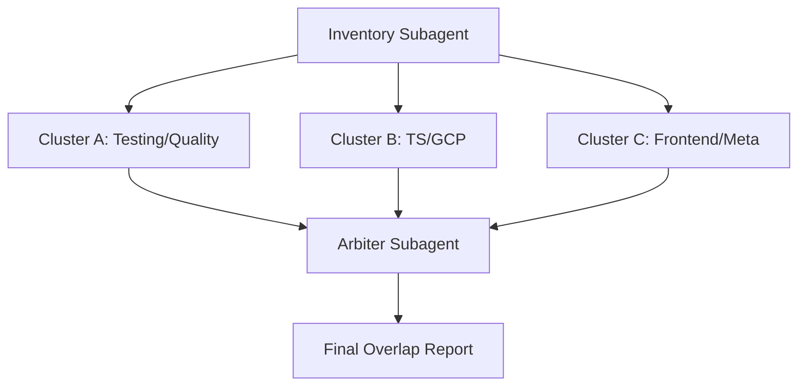

# Skill Overlap Audit Strategy

## Status

Accepted

## Purpose

Define a repeatable, subagent-based strategy to find redundant or overlapping first-party skills under `skills/`, and to separate true consolidation candidates from intentionally complementary skills.

## Scope

- **In scope:** First-party skills under `skills/` (including `skills/claude.ai/` when present). One audit run may cover all or a subset.
- **Out of scope:** `.agents/skills/` and externally installed skills unless you explicitly run a second pass.

## Goals

Identify pairs or clusters that are:

1. **Trigger-overlapping** — likely to activate on the same user request.
2. **Content-overlapping** — teach substantially the same concepts or workflows.
3. **Complementary** — adjacent but intentionally separated by platform, tool, or lifecycle phase (keep separate; optionally add cross-links).

Flag a pair for consolidation only when trigger overlap is high, content overlap is medium or high, and complementarity is low or absent.

## Subagent Layout

Use four focused readonly subagents (no large catalog):

| Step | Subagent | Role |
|------|----------|------|
| 1 | Inventory | Read every `skills/*/SKILL.md`, matching `metadata.json`, and `skill-registry.json`; return one normalized record per skill. |
| 2–4 | Cluster A, B, C | Analyze 2–3 topical clusters in parallel; compare only within cluster; return candidate overlap pairs with evidence. |
| 5 | Arbiter | Review candidate pairs from cluster subagents; reclassify as redundant / overlapping but complementary / not overlapping; require evidence from both skills before labeling redundant. |

## Normalized Inventory Schema

Every inventory and cluster subagent must use the same schema for each skill. Downstream comparison assumes these fields:

| Field | Description |
|-------|-------------|
| `name` | Canonical key from `skill-registry.json`. |
| `path` | Absolute path to the skill directory. |
| `primary_domain` | Shortest stable domain phrase that distinguishes the skill. |
| `primary_mode` | One of: `implementation guide`, `review/audit`, `workflow`, `tooling/config`, `authoring/meta`. |
| `positive_triggers` | Normalized list of "use when" scenarios from SKILL.md and metadata. |
| `negative_triggers` | Explicit anti-triggers ("Do NOT use when"); use `[]` if none. |
| `core_entities` | Main nouns/concepts the skill reasons about (e.g. `react`, `typescript`, `gcp`, `pr`, `testing`). |
| `action_verbs` | Core verbs the skill instructs the agent to perform (e.g. `review`, `refactor`, `verify`, `create`). |
| `artifact_targets` | Concrete files/configs/outputs the skill reads, writes, or produces. |
| `related_skills` | First-party skills with strongest hand-off or overlap. |
| `notes_on_boundary_clarity` | Short note on overlap boundary clarity and any metadata/source anomalies. |

Source precedence: SKILL.md (frontmatter + body) → metadata.json → skill-registry.json.

## Detection Rubric

Score each candidate pair on three axes (High / Medium / Low):

| Axis | Meaning |
|------|--------|
| **Trigger overlap** | Similar user intents, commands, or problem statements. |
| **Content overlap** | Same concepts, workflow phases, examples, or output expectations. |
| **Complementarity** | Clear division by platform, tool, layer, or lifecycle step; explicit "use X instead" or sibling references reduce redundancy risk. |

**Flag for consolidation** only when:

- Trigger overlap: **High**
- Content overlap: **Medium** or **High**
- Complementarity: **Low** or absent

Explicit sibling references and anti-triggers in SKILL.md are strong signals of intentional separation; do not treat those pairs as redundant without strong evidence.

## Evidence to Extract

For each skill, subagents should extract:

- Trigger phrases (from "Use when", "When to apply", applicability gates).
- Anti-trigger phrases ("Do NOT use when").
- Core entities: `react`, `typescript`, `gcp`, `pr`, `testing`, etc.
- Action verbs: `review`, `refactor`, `verify`, `create`, `query`, `instrument`.
- Artifact targets: PR body, `pack.json`, `SKILL.md`, `.hurl`, coverage report.
- Explicit related-skill references.
- Repeated workflow section names: Intake, Validation, Scaffolding, Review.

## How to Run the Audit

Run in order. Use readonly subagents; no edits to the repo are required for the audit itself.

### 1. Inventory subagent

**Prompt (adapt repository path if needed):**

```
Repository: <repo-root>

Task: Perform the inventory step for first-party skills under skills/ only.
Read every skills/*/SKILL.md, matching skills/*/metadata.json when present,
and the corresponding entry in skill-registry.json.

Return:
1. The normalized schema (see docs/specs/skill-overlap-audit.md) that all
   overlap-analysis subagents must use.
2. One normalized record per skill (name, path, primary_domain, primary_mode,
   positive_triggers, negative_triggers, core_entities, action_verbs,
   artifact_targets, related_skills, notes_on_boundary_clarity).

Note missing metadata.json or empty descriptions. Do not recommend edits;
inventory only.
```

Use the schema and inventory table produced here as the single source of truth for the next steps.

### 2. Cluster-analysis subagents (run in parallel)

Split skills into 2–3 topical groups. Example split:

- **Cluster A — Testing and quality:** `tdd-classicist`, `test-verifier`, `vitest-monorepo`, `typescript-testing-organization`, `hurl-testing`, `typescript-quality`, `typescript-error-handling`.
- **Cluster B — TypeScript and GCP/platform:** `esm-typescript`, `nx-monorepo`, `firebase-functions-node`, `gcloud-logging`, `gcp-error-reporting-nodejs`, `gcp-opentelemetry-nodejs`, and optionally `vercel-deploy-claimable` if under `skills/`.
- **Cluster C — Frontend and repo-meta:** `react-best-practices`, `react-native-skills`, `composition-patterns`, `web-design-guidelines`, `commit-hygiene`, `gh-pr-creator`, `create-skill-from-refs`, `create-cursor-pack-from-refs`, `ts-module-documentation`, `go-package-documentation`.

**Prompt per cluster (replace CLUSTER_LABEL and skill list):**

```
Repository: <repo-root>

Use the normalized inventory schema from docs/specs/skill-overlap-audit.md.

Task: Analyze only this cluster of first-party skills: [list skills for this cluster].

For this cluster:
1. Identify overlap candidates.
2. Score each candidate High/Medium/Low for trigger overlap, content overlap, and complementarity.
3. Quote concise evidence from both skills for the strongest pairs.
4. Separate likely consolidation candidates from intentional siblings.
5. Return a shortlist only; do not exhaustively compare obviously unrelated pairs.
```

Each subagent returns: shortlist table, strongest pairs with evidence, and labels (consolidation candidate vs intentional sibling).

### 3. Arbiter subagent

**Prompt:**

```
Repository: <repo-root>

You are the final arbiter for the skill-overlap audit.

Input: The list of candidate pairs and scores from the cluster subagents
(consolidation candidates, intentional siblings, and any ambiguous pairs).

Task:
- Reclassify each pair into exactly one of:
  A. Likely consolidation candidates
  B. Overlapping but complementary
  C. Not overlapping enough to matter
- For A and B, give one recommended action per pair: merge, extract shared
  reference/template, tighten triggers, add anti-triggers, add cross-links,
  leave alone.
- Require explicit evidence from both skills before labeling anything redundant.
- End with a ranked top 5 list of the most important follow-ups for the repo.
```

### 4. Report

The arbiter output is the **final overlap report**. It should include:

- **Likely consolidation candidates** — pairs where merge or shared extraction is recommended.
- **Intentional sibling pairs** — overlapping but complementary; recommended action is usually tighten triggers, add cross-links, or leave alone.
- **Ambiguous pairs** — need human judgment.
- **Recommended actions** — one per flagged pair (merge, extract shared reference, tighten triggers, add anti-triggers, add cross-links, leave alone).
- **Top 5 follow-ups** — ranked list of the most important next steps (content or metadata).

## Execution Flow



## Hotspots to Prioritize

When running the audit, these pairs have historically shown the strongest potential overlap and are worth explicit review:

- `commit-hygiene` + `gh-pr-creator`
- `create-skill-from-refs` + `create-cursor-pack-from-refs`
- `gcp-error-reporting-nodejs` + `gcp-opentelemetry-nodejs`
- Testing family: `tdd-classicist`, `test-verifier`, `vitest-monorepo`, `typescript-testing-organization`

## Success Criteria

An audit run is successful if it produces:

- A small, evidence-backed shortlist of true redundancy candidates.
- A larger set of intentional sibling skills that should stay separate (with optional cross-links or trigger tightening).
- Concrete follow-ups for each flagged pair, preferring trigger tightening and shared references over full merges.

## References

- Plan: Subagent Strategy For Skill Overlap Audit (Cursor plan).
- Repo map and commit conventions: `.cursor/rules/00-repo-map.mdc`, `.cursor/rules/10-commit-conventions.mdc`.
