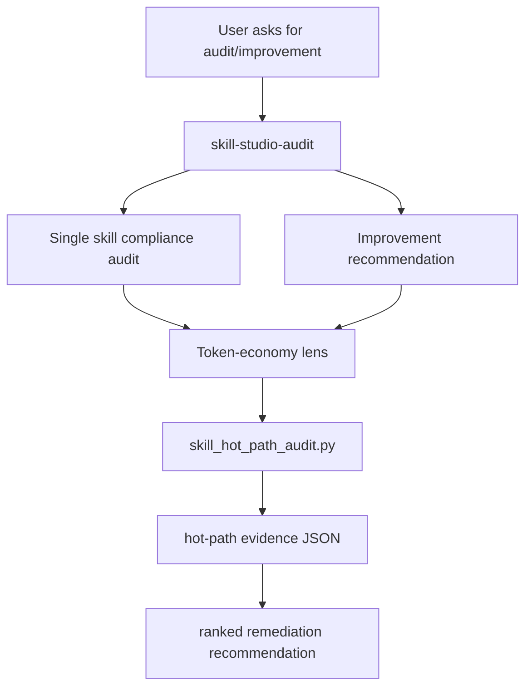

# Skill Studio Token-Economy Audit Design

## Goal
Add a measurable, advisory token-economy workflow to `packs/cursor-skill-studio` without changing the pack's core three-router architecture. The workflow should help `/skill-studio-audit` diagnose prompt-visible surface problems such as long descriptions, bloated `SKILL.md` routers, duplicated routing text, and references/assets/scripts that are not clearly separated.

## Architecture
Keep the existing three bundled skills as the hot-path routers:



The Python auditor should be evidence-only. It should not decide what to rewrite, modify files, or claim provider-boundary token accuracy. It should produce stable JSON that the audit skill can cite when recommending changes.

## Files To Change
- `packs/cursor-skill-studio/skills/skill-studio-audit/SKILL.md`: add token-economy as an explicit Branch A/B concern, and mention the new script in the router table or branch procedures.
- `packs/cursor-skill-studio/skills/skill-studio-audit/references/single-skill-audit.md`: add a token-economy evidence step that runs or interprets the auditor output.
- `packs/cursor-skill-studio/skills/skill-studio-audit/references/skill-improvement.md`: expand the hot-path and trigger-surface dimensions using the GSD lessons: availability vs visibility, routing tags, capped context, and escape hatches.
- `packs/cursor-skill-studio/skills/skill-studio-audit/references/pack-improvement.md`: add pack-level token-economy checks for bundled skills, rules, subagents, README duplication, and frequent-path context rediscovery.
- `packs/cursor-skill-studio/skills/skill-studio-audit/assets/templates/improvement-recommendation.md`: add an evidence section for measured hot-path facts and caveats.
- `packs/cursor-skill-studio/skills/skill-studio-audit/scripts/skill_hot_path_audit.py`: new Python script.
- `packs/cursor-skill-studio/README.md` and `packs/cursor-skill-studio/ROADMAP.md`: briefly document the new audit capability and close/replace the existing description-optimization follow-up if appropriate.
- Optional release files after implementation: `packs/cursor-skill-studio/CHANGELOG.md` and `packs/cursor-skill-studio/VERIFICATION.md` if we treat this as a pack release slice.

## Python Auditor Contract
The script should accept either a single skill root, a skills directory, or a pack root:

```bash
python3 packs/cursor-skill-studio/skills/skill-studio-audit/scripts/skill_hot_path_audit.py <path> --json
```

For each skill-like target, emit JSON with:
- identity: path, name, description, `disable-model-invocation` state;
- hot-path metrics: `SKILL.md` line count, body chars, approximate token estimate, description chars, description token estimate;
- package shape: counts for `references/`, `assets/`, `scripts/`, direct links from `SKILL.md`;
- duplication signals: repeated headings or repeated high-signal phrases between description/body/references, reported as advisory findings;
- threshold findings: long description, router over target size, missing one-hop references, procedure-heavy description, broad or vague trigger words;
- caveats: estimates are static source metrics, not provider-boundary telemetry.

For a pack root, it should discover bundled skills under `skills/*/SKILL.md`, inspect `.cursor/rules/*.mdc` and `.cursor/agents/*.md` counts/description lengths, and summarize pack-level prompt-visible surfaces.

## Design Constraints
- Advisory only: no file edits, no auto-rewrites, no pass/fail release gate by default.
- Reuse local style from existing Python scripts: stdlib only, `argparse`, `json`, `Path`, deterministic output, clear `SystemExit` errors.
- Keep the audit skill as the owner. Do not add a fourth bundled skill unless future evidence shows token-economy audits deserve a separate router.
- Preserve the current explicit-only router architecture; this applies the research as an audit/evidence capability first, not a routing restructure.
- Be honest about limits: the script estimates hot-path source pressure, while GSD's strongest evidence came from final provider-boundary auditing.

## Verification
- Run the Python auditor against:
  - `packs/cursor-skill-studio/skills/skill-studio-write`
  - `packs/cursor-skill-studio/skills/skill-studio-audit`
  - `packs/cursor-skill-studio`
- Run existing validation:
  - `bash packs/cursor-skill-studio/skills/skill-studio-write/scripts/validate-skill.sh packs/cursor-skill-studio/skills/skill-studio-audit`
  - `bash scripts/cursor-pack-verify.sh --pack=cursor-skill-studio`
- Read the generated JSON and confirm it flags the known ROADMAP item: long bundled-skill descriptions.
