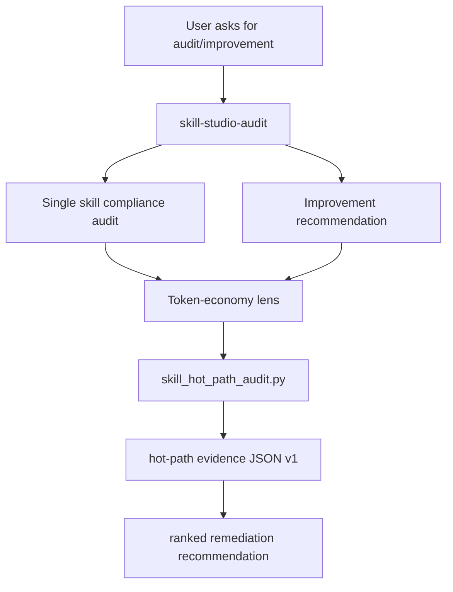

# Skill Studio Token-Economy Audit Design

## Goal

Add a measurable, advisory token-economy workflow to
`packs/cursor-skill-studio` without changing the pack's core three-router
architecture. The workflow helps `/skill-studio-audit` diagnose
prompt-visible surface problems — long descriptions, bloated `SKILL.md`
routers, named duplication buckets, and references/assets/scripts that are
not clearly separated.

## Hot Path Definition

The auditor needs a defensible definition of "hot path" because the
GSD research warns against measuring intermediate layers. This spec
fixes the following definitions for Cursor packs:

- **Skill hot path** = the frontmatter `description` (always shipped to
  the routing surface, even when `disable-model-invocation: true`)
  plus the `SKILL.md` body once the skill is invoked.
- **Pack hot path** = the union of:
  - every bundled skill's frontmatter `description` (always shipped),
  - `pack.json` `description` (shipped via pack manifest indexing),
  - any rule file with `alwaysApply: true` (always attached),
  - subagent descriptions in `.cursor/agents/*.md` (shipped when the
    subagent picker is constructed).
- **Cold path** = `references/`, `assets/`, `scripts/`, README/CHANGELOG,
  rules with `alwaysApply: false` that did not match the active context,
  and bundled skills not currently invoked. These are *available* but
  not *prompt-visible* by default.

`disable-model-invocation: true` removes a skill from auto-routing but
does NOT prevent the frontmatter description from being indexed and
shipped. The auditor treats descriptions as hot-path regardless of this
flag and surfaces the distinction in findings.

## Architecture



The Python auditor is evidence-only. It does not modify files, does not
gate releases, does not claim provider-boundary token accuracy, and
does not classify by abstract token estimates. It emits versioned JSON
with character counts, named duplication buckets, and threshold
findings whose thresholds are explicit and cited in the output.

## Decisions Log

Decisions are recorded inline so reviewers know which trade-offs were
intentional.

### D1 — Drop token-estimate fields, keep char counts

`chars/4` token estimates are misleading at the source layer (per the
research: "Token estimates inside intermediate layers can be
misleading"). The auditor emits `*_chars` only. Caveats include a
single sentence explaining the approximate conversion if a reader
wants to ballpark — but it is not a published field.

### D2 — Calibrate thresholds against the studio's own routers

Thresholds are calibrated against measured values in the bundled
studio skills (the worst-case routers we ship):

| Threshold | Value | Rationale |
|---|---:|---|
| `description_info` | 300 chars | Below the smallest studio router description; soft target for compact routing tags. |
| `description_warn` | 500 chars | Above the smallest current studio router; under the largest. Sized to flag bloat without immediately flagging every current router. |
| `description_error` | 1024 chars | Cursor's hard frontmatter limit. Past this the description does not load. |
| `router_lines_warn` | 350 lines | Matches existing `inspect-candidate-skill.sh` warning. |
| `router_lines_error` | 500 lines | Matches existing `validate-skill.sh` hard cap. |

Thresholds are echoed back in the JSON output so a future caller can
see what the script used.

### D3 — The auditor audits itself, and the studio routers are expected
to fail `description_warn` until trimmed.

`skill-studio-audit` and `skill-studio-write` ship long descriptions
(688 and 927 chars). Self-audit findings on those skills are the
calibration baseline, not bugs. ROADMAP already tracks "description
tightening" as a separate slice; this auditor produces the evidence
that slice will cite.

### D4 — Named duplication buckets, not generic similarity

The auditor reports only the duplication shapes that mapped to
real-world bloat in the Inspect Skill Studio review. No generic
n-gram similarity matcher. The buckets:

- `description_repeats_body_heading` — phrase ≥ 5 words present in
  both the frontmatter description and one of the `SKILL.md` body
  headings (H1–H3).
- `applicability_gate_repeats_description` — bullet under an
  "Applicability Gate" heading whose normalized form is a substring of
  the description (or vice versa).
- `multi_skill_shared_phrase` (pack scope) — identical ≥ 8-word phrase
  present in two or more bundled skill `SKILL.md` files.
- `pack_readme_duplicates_intent_table` (pack scope) — pack README
  contains an "Intent Router" or "Branch" table row whose first two
  columns also appear verbatim in a bundled `SKILL.md`.

### D5 — JSON schema is versioned and additive only

Output includes `schema_version: 1`. New fields are additive within
the major version. Renames or removals bump to `schema_version: 2`
and are documented in CHANGELOG.

### D6 — Auditor stays bundled, runs from `scripts/`

The auditor lives at `skills/skill-studio-audit/scripts/skill_hot_path_audit.py`
and ships with the pack (the install copies the entire skill folder).
This costs bytes on disk but is not prompt-visible; the script is not
loaded into context unless explicitly run. Excluding it would break the
self-contained "audit + tooling" model.

### D7 — Reconcile `cursor-skill-standard.md` in the same slice

The current standard teaches the `Use when … Do not use when …`
formula. The auditor's `procedural_description` finding would
otherwise penalize every skill that followed the pack's own teaching.
We update the standard to:

- keep the `Use when` formula as the **default** for auto-invoked
  skills,
- add a **router exception**: skills with `disable-model-invocation: true`
  should prefer keyword-tag descriptions because they pay description
  cost without benefiting from the auto-routing the formula is
  optimized for.

### D8 — Slice scope is intentional

This change touches the auditor, four audit references, the
recommendation template, the authoring standard, the README, and the
ROADMAP — together. The pieces co-depend: shipping the auditor without
updating the standard creates contradictory recommendations; shipping
the buckets without updating the recommendation template leaves
recommenders without a place to cite the evidence. The slice is one
PR by design.

### D9 — Sunset path

If Cursor later exposes provider-boundary telemetry, this auditor
becomes obsolete or downgraded to a "static checks only" companion.
The JSON reserves a top-level `runtime_observations` field, set to
`null` today, so future runtime data can be merged into the same
shape without breaking consumers.

### D10 — Verification has a snapshot, not just execution

A fixture pack under `skills/skill-studio-audit/scripts/tests/fixtures/`
plus an `expected.json` snapshot proves the auditor produces the
correct *content*, not only that it runs. A small shell driver diffs
actual vs expected. Snapshot updates are deliberate (regenerate via
`--write-snapshot` flag described below).

## Files To Change

- `packs/cursor-skill-studio/skills/skill-studio-audit/scripts/skill_hot_path_audit.py`:
  rewrite. Drop token-estimate fields. Add `schema_version`, named
  duplication buckets, calibrated thresholds, threshold echo,
  `runtime_observations: null`, and `--write-snapshot`.
- `packs/cursor-skill-studio/skills/skill-studio-audit/scripts/tests/fixtures/`:
  new fixture pack + `expected.json`.
- `packs/cursor-skill-studio/skills/skill-studio-audit/scripts/tests/run_audit_snapshot.sh`:
  new driver that runs the auditor against the fixture and diffs.
- `packs/cursor-skill-studio/skills/skill-studio-audit/SKILL.md`:
  cite the new buckets and thresholds-echo behavior in Branch A/B
  procedures.
- `packs/cursor-skill-studio/skills/skill-studio-audit/references/single-skill-audit.md`:
  add a "Token-economy evidence step" that names the JSON fields and
  buckets the audit cites.
- `packs/cursor-skill-studio/skills/skill-studio-audit/references/skill-improvement.md`:
  expand hot-path / trigger-surface dimension with the explicit
  hot-path definition and the router-exception rule from D7.
- `packs/cursor-skill-studio/skills/skill-studio-audit/references/pack-improvement.md`:
  add the pack-level duplication buckets and the rule that
  `alwaysApply: true` rules count as hot-path.
- `packs/cursor-skill-studio/skills/skill-studio-audit/assets/templates/improvement-recommendation.md`:
  replace the "static-source caveat" wording with a concrete schema
  field reference and a duplication bucket slot.
- `packs/cursor-skill-studio/skills/skill-studio-write/references/cursor-skill-standard.md`:
  add the "Description token economy" subsection and the router
  exception described in D7.
- `packs/cursor-skill-studio/README.md` and
  `packs/cursor-skill-studio/ROADMAP.md`: mention the auditor's new
  schema and the snapshot test.

## Python Auditor Contract (v1)

Usage:

```bash
python3 packs/cursor-skill-studio/skills/skill-studio-audit/scripts/skill_hot_path_audit.py <path> [--json] [--write-snapshot <file>]
```

`<path>` may be a skill root, a skills directory, or a pack root.
Detection is by presence of `SKILL.md`, `pack.json`, or `skills/`
respectively.

### Top-level JSON shape

```json
{
  "schema_version": 1,
  "generated_by": "skill_hot_path_audit.py",
  "target_kind": "skill" | "skills_dir" | "pack",
  "thresholds": { /* echoes the thresholds the run used */ },
  "skills": [ /* per-skill audits */ ],
  "pack": { /* present when target_kind == "pack" */ },
  "runtime_observations": null,
  "caveats": [
    "All metrics are character counts of source files; the auditor does not call any tokenizer.",
    "Findings are advisory and do not gate releases.",
    "Roughly 1 token ≈ 4 characters for common English models — use only to ballpark."
  ]
}
```

### Per-skill shape

```json
{
  "identity": {
    "path": "...",
    "name": "...",
    "description": "...",
    "disable_model_invocation": true
  },
  "hot_path_metrics": {
    "skill_md_lines": 207,
    "skill_md_body_chars": 6021,
    "description_chars": 688
  },
  "package_shape": {
    "references_count": 6,
    "assets_count": 2,
    "scripts_count": 1,
    "direct_links_count": 9
  },
  "duplication_buckets": [
    {"bucket": "description_repeats_body_heading", "evidence": "..."},
    {"bucket": "applicability_gate_repeats_description", "evidence": "..."}
  ],
  "findings": [
    {
      "id": "long_description",
      "severity": "warn",
      "value": 688,
      "threshold": 500,
      "rationale": "Above description_warn=500 (calibrated against studio routers)."
    }
  ]
}
```

### Pack-scope shape

```json
{
  "name": "cursor-skill-studio",
  "pack_json_description_chars": 988,
  "rules": [
    {"path": ".cursor/rules/10-skill-studio-routing.mdc", "always_apply": false, "description_chars": 0}
  ],
  "agents": [
    {"path": ".cursor/agents/skill-architecture-checker.md", "description_chars": 142}
  ],
  "cross_skill_duplication_buckets": [
    {"bucket": "multi_skill_shared_phrase", "phrase": "...", "skills": ["skill-studio-write", "skill-studio-audit"]},
    {"bucket": "pack_readme_duplicates_intent_table", "evidence": "..."}
  ]
}
```

### Finding ids and thresholds

| Finding id | Trigger | Severity |
|---|---|---|
| `long_description_info` | `description_chars > 300` | info |
| `long_description` | `description_chars > 500` | warn |
| `description_exceeds_cursor_limit` | `description_chars > 1024` | error |
| `router_too_long` | `skill_md_lines > 350` | warn |
| `router_over_hard_cap` | `skill_md_lines > 500` | error |
| `procedural_description` | description contains `"Invoke explicitly via"` or `"Use when"` AND `disable_model_invocation` is true | info |
| `description_repeats_body_heading` | bucket present | info |
| `applicability_gate_repeats_description` | bucket present | info |
| `multi_skill_shared_phrase` | bucket present (pack scope) | info |
| `pack_readme_duplicates_intent_table` | bucket present (pack scope) | info |

Findings include `value`, `threshold` (when applicable), and a
one-sentence `rationale`. The `thresholds` block at the top of the
output lets readers see the rule values without reading the script.

## Design Constraints

- Advisory only: no file edits, no auto-rewrites, no pass/fail release gate.
- Stdlib only (`argparse`, `json`, `re`, `pathlib`); deterministic output
  (sorted skills, sorted findings by id, sorted buckets).
- The script is calibrated to be honest about its own limits: char
  counts and named buckets, nothing more.
- `cursor-skill-standard.md` is updated in the same slice to remove the
  contradiction with `procedural_description` findings.

## Verification

1. Snapshot test:
   `bash packs/cursor-skill-studio/skills/skill-studio-audit/scripts/tests/run_audit_snapshot.sh`
   must print `OK` and exit 0.
2. Self-audit smoke runs (no snapshot, used to confirm calibration):
   - `python3 packs/cursor-skill-studio/skills/skill-studio-audit/scripts/skill_hot_path_audit.py packs/cursor-skill-studio --json`
   - Output must contain a `long_description` finding for at least one
     bundled studio skill (D3 calibration baseline).
3. Existing validators must still pass:
   - `bash packs/cursor-skill-studio/skills/skill-studio-write/scripts/validate-skill.sh packs/cursor-skill-studio/skills/skill-studio-audit`
   - `bash scripts/cursor-pack-verify.sh --pack=cursor-skill-studio`
