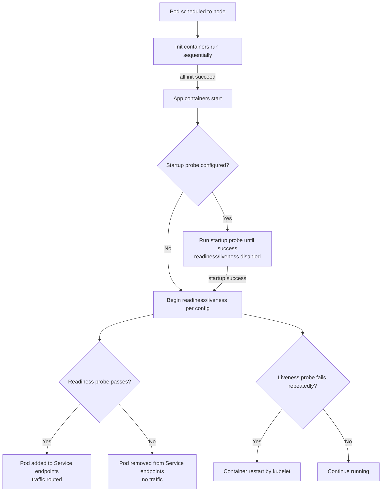
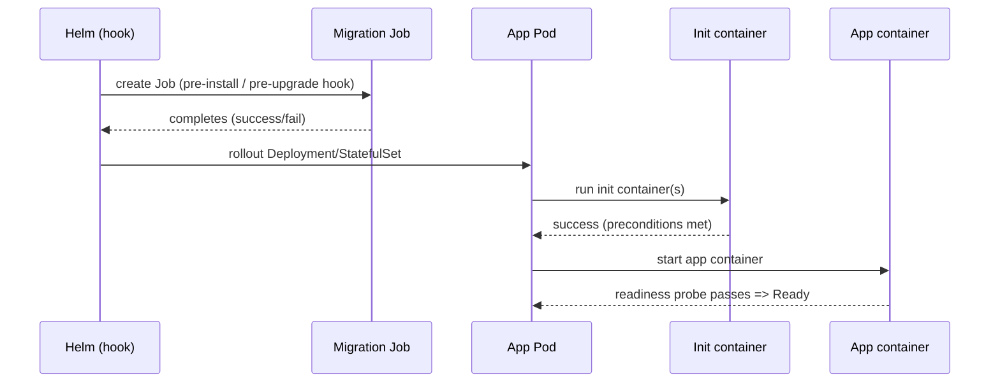

# Kubernetes Init Containers, Readiness Probes, and Liveness Probes Best Practices

## Executive summary

Init containers, readiness probes, and liveness probes exist to make workloads *operationally safe by default*: init containers gate startup on prerequisite work (or prerequisite *evidence*), readiness probes gate *traffic*, and liveness probes gate *restart* when a process is unrecoverably broken. Kubernetes treats these signals differently: a failing readiness probe removes the Pod from Service endpoints, while repeated liveness failures trigger a container restart by the kubelet; readiness and liveness do not depend on each other’s success. citeturn2view0turn2view1turn4view0

The mistake pattern that causes the most production pain is *turning probes into distributed dependency checkers*. Upstream Kubernetes documentation explicitly warns that incorrect liveness probe implementations can lead to cascading failures, and cloud-provider guidance repeatedly recommends keeping liveness independent from external systems (for example, databases) to avoid restart storms and amplified outages. citeturn2view1turn5view0turn5view1

A resilient “real-world default” is: **startup probe for slow starters**, **readiness probe for “can serve now”**, **liveness probe for “is wedged and needs restart”**—often using the same low-cost endpoint, but with a *higher failureThreshold* on liveness so that traffic stops before restarts begin. This pattern is called out directly in upstream probe configuration guidance and reinforced by provider best-practice docs. citeturn2view1turn5view0turn6view1turn7view0turn18view0

Init containers are best when the prerequisite work is clearly bounded and idempotent: generate config, stage files into a shared volume, fetch or transform secrets, wait for required Services to exist, or gate startup until preconditions are met. They run **sequentially**, must **run to completion**, and if they fail the kubelet restarts them until success (subject to restartPolicy), meaning you must design init steps to be safe to retry and safe to re-run. citeturn4view0turn13view0

Observability-wise, probes are *local control-plane signals*, not a full health strategy. You typically combine probe outcomes (events, readiness flaps), restart behavior (CrashLoopBackOff backoff), and service-level telemetry (errors, latency) plus synthetic “outside-in” checks (for example via Prometheus blackbox probing) to detect real incidents while avoiding noisy self-inflicted churn. citeturn13view0turn20view0turn11search2turn11search8

Assumptions: this report describes behavior as documented in upstream Kubernetes docs and major provider guidance as of their latest updates shown in the cited sources; version-specific features (for example gRPC probes, probe-level terminationGracePeriodSeconds) are explicitly labeled where relevant. citeturn8view1turn8view2turn2view1

## Core concepts and mental models

Kubernetes uses **probes** to let the kubelet decide (a) whether a container is ready to accept traffic (readiness), (b) whether it should be restarted (liveness), and optionally (c) whether it has finished starting (startup). Readiness failures remove the Pod from matching Service endpoints; liveness failures lead to restarts; startup probes delay readiness/liveness until startup succeeds, preventing premature kill/restart on slow starters. citeturn2view0turn2view1turn6view0turn7view0turn18view0

**Init containers** are “startup-only” containers: they run *before* application containers, run sequentially, and must complete successfully for the Pod to proceed. They are exactly like normal containers in most spec fields (resources, volumes, security), but regular init containers do **not** support lifecycle hooks or readiness/liveness/startup probes—completion is their readiness signal. Init containers can also be used to block app startup until preconditions are met, and they can be given access to Secrets or tools that you intentionally keep out of the main image. citeturn4view0

A useful operational framing is to map each mechanism to the blast radius of the action it triggers:

- **Init containers**: *block startup*; failure loops keep the Pod Pending/Initializing.
- **Readiness probe**: *stop routing traffic*; the container keeps running.
- **Liveness probe**: *restart the container*; misuse can create restart storms.
- **Startup probe**: *protect initialization*; when present, readiness/liveness are disabled until it succeeds. citeturn2view0turn2view1turn4view0turn5view0turn18view0

Two less-obvious but production-relevant “gates” sit adjacent to probes:

- **Pod conditions** include `Initialized` (all init containers complete) and `Ready` (Pod should receive traffic). citeturn22view3turn13view0
- **Readiness gates** (`readinessGates`) let you add custom conditions that must be `True` *in addition to* container readiness for the Pod to be Ready; if a condition is missing, it defaults to `False`. This is commonly used to synchronize readiness with external infrastructure (for example, load balancer target registration). citeturn22view0turn19view0turn21view0


citeturn4view0turn2view1turn2view0

## Probe configuration parameters and recommended ranges

Kubernetes probe behavior is controlled by a small set of timing and threshold parameters. Upstream documentation defines their semantics and defaults:

- `initialDelaySeconds` (default 0): wait time after container start before executing probes; when a startup probe exists, liveness/readiness delays don’t begin until startup succeeds. citeturn3view0  
- `periodSeconds` (default 10, min 1): probe interval; note that while a container is not Ready, readiness probing may run at times other than the configured period to make the Pod ready faster. citeturn3view0  
- `timeoutSeconds` (default 1, min 1): per-probe timeout. citeturn3view0  
- `successThreshold` (default 1): consecutive successes required after failure; **must be 1 for liveness and startup probes**. citeturn3view0  
- `failureThreshold` (default 3): consecutive failures before the probe is considered failed; for liveness/startup this triggers restart/kill behavior; for readiness it marks the container not ready. citeturn3view0turn2view1

Two additional timing knobs matter in real systems:

- `terminationGracePeriodSeconds`: the grace period before forced termination; kubelet honors this for probe-triggered restarts, and Kubernetes supports **probe-level** `terminationGracePeriodSeconds` for liveness/startup probes (feature noted as stable starting in newer releases; readiness probes reject it). citeturn8view2turn20view0  
- Startup probe sizing rule of thumb: choose `failureThreshold * periodSeconds` to cover worst-case startup time; upstream docs show a concrete 5-minute example (30×10s). citeturn3view3turn18view0turn5view0

### Recommended starting ranges by workload type

The table below provides **heuristic starting ranges** most often seen to work in production as a baseline, derived from: (a) Kubernetes defaults and semantics, (b) upstream cautions about liveness probe misconfiguration and cascading failures, and (c) provider guidance emphasizing startup-probe protection for slow/unpredictable initialization and avoiding external calls inside probes. You should treat these as *initial tuning bands*, then calibrate using observed startup time distributions (Google’s guidance explicitly recommends using p99 startup time for initial delays) and health endpoint latency. citeturn3view0turn6view0turn2view1turn5view0turn6view1turn5view1turn18view0

| App type | Readiness: typical goal | Readiness suggested starting band | Liveness suggested starting band | Startup probe guidance |
|---|---|---|---|---|
| Stateless web (fast start, HTTP) | “Safe to receive traffic” (routes around warmup) | `initialDelaySeconds`: 0–5 (or 0 + startup probe) • `periodSeconds`: 5–10 • `timeoutSeconds`: 1–2 • `failureThreshold`: 2–3 • `successThreshold`: 1–2 | `initialDelaySeconds`: 10–30 (or 0 + startup probe) • `periodSeconds`: 10–20 • `timeoutSeconds`: 1–2 • `failureThreshold`: 3–5 • `successThreshold`: 1 (required) | Usually optional; use if cold start tail latency is large or variable citeturn6view0turn3view3turn2view1 |
| Stateful service (long I/O, leadership/quorum, persistent storage) | “Can serve requests without corrupting state” | `initialDelaySeconds`: 5–20 • `periodSeconds`: 5–15 • `timeoutSeconds`: 2–5 • `failureThreshold`: 3–6 • `successThreshold`: 1–3 | `initialDelaySeconds`: 30–120 • `periodSeconds`: 15–30 • `timeoutSeconds`: 2–5 • `failureThreshold`: 3–6 • `successThreshold`: 1 (required) | Often recommended if boot involves replay, recovery, compaction, or quorum formation citeturn2view0turn3view0turn18view0turn15view0 |
| JVM apps (slow start, classloading, cache hydration) | “Started + warmed enough to avoid immediate errors/timeouts” | `initialDelaySeconds`: 0–10 with startup probe preferred • `periodSeconds`: 5–10 • `timeoutSeconds`: 1–3 • `failureThreshold`: 3–6 | `initialDelaySeconds`: 0 with startup probe preferred • `periodSeconds`: 10–20 • `timeoutSeconds`: 1–3 • `failureThreshold`: 3–5 | Prefer startup probe sized to worst-case startup; entity["company","Amazon Web Services","cloud provider"] guidance uses a Java example with ~2 minutes warmup and recommends startup probes to avoid premature readiness/liveness failures citeturn5view1turn5view0turn3view3 |
| Init-heavy startup (migrations, large config generation, data seeding) | “Preconditions satisfied, then accept traffic” | Often rely on init container completion + lightweight readiness; `periodSeconds`: 5–10, `timeoutSeconds`: 1–2 | Consider conservative liveness (or omit initially) to avoid restart storms during expensive init cycles; if used, increase thresholds | Use startup probe if main container can be “alive but not ready” for extended time citeturn4view0turn3view3turn2view1 |

Key tuning principles that consistently prevent production incidents:

- Prefer **startup probes** over very large `initialDelaySeconds` when startup time is variable; multiple providers and upstream docs highlight startup probes as the mechanism to prevent liveness/readiness interference with slow startup. citeturn2view0turn3view3turn5view0turn7view0turn18view0  
- Size timeouts based on actual tail latency of the probe endpoint; the default 1s is intentionally small and often too aggressive for overloaded nodes or JVM cold paths. citeturn3view0turn2view1  
- Avoid very small `periodSeconds` unless you are certain probe work is trivial; readiness may run more frequently while unready, so expensive checks can multiply load exactly when the system is stressed. citeturn3view0turn6view1

## Probe handler choices and endpoint design

Kubernetes supports multiple probe mechanisms; in practice, most production setups converge on HTTP for application workloads and TCP/exec for edge cases. Provider and upstream docs also emphasize that probe mechanisms should be chosen to be *low-cost* and representative of the correct failure mode (deadlock vs “not ready yet”). citeturn2view1turn6view0turn5view1turn18view0

### Handler comparison

| Handler | What it verifies | Strengths | Failure modes / risks | Best fit |
|---|---|---|---|---|
| `httpGet` | HTTP endpoint returns 2xx–3xx | Most expressive for “can serve”; easy to implement separate `/ready` vs `/live`; supports headers; works well with orchestrators and load balancers citeturn6view0turn18view0turn3view0 | Endpoint can become “too smart” (dependency fan-out, heavy work) and create cascades; must ensure it’s reachable on Pod IP/port citeturn6view1turn2view1 | Typical stateless services, APIs, gateways |
| `tcpSocket` | TCP connection can be established | Useful for non-HTTP protocols or when only “port open” is meaningful citeturn6view0turn18view0turn2view1 | False positives: port open but app not functional; kubelet makes TCP probe from the node (not inside Pod), so you can’t rely on cluster DNS service names via `host` in the probe citeturn8view2turn18view0 | Proxy ports, gRPC without health, simple daemons |
| `exec` | Command exits 0 | Most flexible: can inspect filesystem, local IPC state, pidfiles, internal CLI health commands citeturn6view0turn2view1turn18view0 | Risk of resource overhead and stuck processes; entity["company","Microsoft","technology company"] and entity["company","Google","technology company"] provider guidance emphasizes tailoring delays/timeouts, and entity["company","Amazon Web Services","cloud provider"] explicitly warns that exec-based probes must exit before `timeoutSeconds` to avoid `<defunct>` processes and potential node failure citeturn5view1turn7view0turn6view1 | Legacy apps without HTTP health endpoints; low-level daemons |

Two additional handlers matter for completeness in modern clusters:

- **gRPC probes** are supported (feature state noted stable in Kubernetes v1.27) if the app implements the gRPC Health Checking Protocol; Kubernetes notes limitations like no named port/hostname and no auth parameters, and treats configuration problems as probe failures. citeturn8view1turn20view2  
- **Probe-triggered events** are observable via Pod events; upstream docs show `Warning Unhealthy` and `Normal Killing` events emitted by kubelet when liveness fails. These are useful for diagnosing whether “health” issues are real or probe misconfigurations. citeturn20view0turn2view1

### Endpoint design: “dumb enough” is a feature

A recurring provider best practice is that a “good default” readiness endpoint can be as simple as returning HTTP 200 once initialization is complete, while more advanced logic (for example, introspecting connection pools) should be validated against real error-rate and load behavior. Google’s GKE guidance strongly cautions: “Never make any probe logic access other services,” because it can compromise Pod lifecycle if those services are slow or down. citeturn6view1turn6view2turn2view1

In practice, production-grade endpoint design usually follows one of these models:

- **Liveness endpoint**: confirms the process is making progress (not deadlocked) and is capable of serving *some* minimal in-process response; upstream docs explicitly cite deadlock detection as a liveness use case. citeturn2view0turn6view0turn6view1  
- **Readiness endpoint**: confirms that initialization is done and the service can accept traffic; upstream docs highlight readiness for time-consuming init tasks including warming caches and establishing connections, and for temporary overload recovery later in lifecycle. citeturn2view0turn6view0turn6view1  
- **Shared endpoint with different thresholds**: upstream guidance calls out a common pattern of using the *same low-cost endpoint* for readiness and liveness but with a higher `failureThreshold` on liveness so traffic drains before restarts. citeturn2view1turn5view0  

## Probing external dependencies and avoiding cascades

### The core tradeoff: correctness vs blast radius

Checking external dependencies (databases, caches, message brokers, downstream APIs) inside probes seems attractive (“don’t route traffic to a Pod that can’t reach its DB”), but it creates two systemic risks that show up repeatedly in real incidents:

- **False negatives and retry storms**: transient dependency slowness or network partitions can flip *many* Pods to unready or trigger restarts, amplifying the dependency outage into an application outage. Upstream docs explicitly warn that incorrect liveness probe implementation can cause cascading failures and restart churn under high load. citeturn2view1turn5view1  
- **Availability collapse from shared fate**: if every replica checks the same backend and gates readiness on it, then a backend outage can mark *all* replicas unready simultaneously; AWS guidance explicitly warns that readiness probes depending on external connectivity can cause outages and cascading failures. citeturn5view0turn5view1

As a result, major provider guidance tends to be stricter for liveness than readiness:

- Liveness: **do not depend on external factors** (example given: database). citeturn5view0turn5view1  
- Readiness: may include “dependencies are running without issues,” but must be designed so it doesn’t take the fleet down when the dependency is degraded; AWS calls out this exact failure mode. citeturn5view0  
- GKE guidance: **never make probe logic access other services**, because slow/down dependencies can compromise Pod lifecycle transitions. citeturn6view1

### Practical patterns for dependency-aware readiness without “probe fan-out”

A robust compromise is: **don’t make the probe perform new dependency actions**, but allow the probe to reflect **locally cached dependency state** the application already maintains. This aligns with the “no external calls from probe logic” guidance while still preventing obviously broken Pods from receiving traffic. citeturn6view1turn2view0turn5view0

Concrete examples of “local state” readiness signals (implementation-specific, but operationally common) include:

- “DB pool has at least one healthy connection and last successful query timestamp is recent” (no new query in the probe path). citeturn6view1turn2view0  
- “Consumer has caught up to a minimum offset and local caches are warmed” (readiness indicates ability to serve acceptable SLOs, not perfect dependency health). citeturn2view0turn6view1  
- “Feature flags/config snapshot present on local disk/volume” (probe checks local artifact created by init/sidecar, not the remote system). citeturn4view0turn6view1

### Decision matrix: which probe strategy to choose?

The table below compares common strategies in terms of operational tradeoffs; it synthesizes upstream warnings about cascading failures, provider guidance on external dependency checks, and readiness-gate patterns that external controllers use for infrastructure synchronization. citeturn2view1turn5view0turn6view1turn19view0turn22view0

| Strategy | Readiness checks | Liveness checks | Pros | Cons / failure modes | When it’s usually best |
|---|---|---|---|---|---|
| Internal-only probes | Only in-process health + initialization done | Only in-process “stuck/deadlocked” signals | Minimizes cascades; keeps lifecycle stable under dependency incidents; aligns with “don’t access other services” guidance citeturn6view1turn2view1 | Can route traffic to Pods that will return dependency errors unless app has good fallbacks/timeouts | Apps with strong resilience patterns (timeouts, circuit breakers) and graceful degradation citeturn5view0turn19view0 |
| Dependency-aware readiness via local state | Local view of dependency health (cached), not fresh calls | In-process only | Reduces user-visible errors without fan-out; avoids probe-induced load on dependencies citeturn6view1turn2view0 | Requires careful app instrumentation; risk of stale state causing delayed readiness | Online transactional services where “dependency down” means “nearly all requests fail” citeturn2view0turn5view0 |
| Direct dependency probing in readiness | Probe performs network call (ping/query) | In-process only | Quickly removes Pods that truly can’t reach required backends citeturn2view0turn5view0 | High risk of fleet-wide unready during dependency outage; can create cascading failure/outage citeturn5view0turn6view1 | Narrow cases where backend is strictly required and you can bound blast radius (per-tenant isolation, partitioned dependencies, or very small fan-out) citeturn5view0turn2view1 |
| Readiness gates via external controller | Readiness requires custom condition set by controller (e.g., LB target “Healthy”) | In-process only | Solves infrastructure synchronization (LB registration) cleanly; prevents dropped traffic during rollouts citeturn22view0turn21view0turn19view0 | Extra moving parts; incorrect webhook/controller failurePolicy can block deploys or reduce safety citeturn21view0 | North–south traffic where external LB propagation is slower than Endpoint updates (common with low replica counts) citeturn19view0turn21view0 |

### When to probe dependencies outside of Kubernetes probes

Even if you keep in-cluster probes internal, you still typically want “outside-in” checking:

- Cloud load balancers provide an independent health-check layer outside the Kubernetes control plane; AWS explicitly recommends ELB health checks as a complementary safeguard that continues during control plane disruptions or probe execution delays. citeturn19view0  
- Synthetic monitoring via Prometheus blackbox probing exposes `probe_success` for HTTP/TCP checks and is well-suited for catching DNS, routing, and TLS issues that in-Pod probes may not see. citeturn11search2turn11search8

## Init container strategies for real workloads

Init containers shine when you can make the prerequisite work **deterministic, bounded, and idempotent**. Kubernetes emphasizes that init containers can be retried/re-executed and therefore “should be idempotent,” especially when writing into shared volumes. citeturn4view0turn13view0

### Common production use cases

**Migrations and schema prep**  
Init containers can run migrations directly (blocking app startup), but this can become risky with large fleets: every replica may attempt migration unless you add leader election/locking, and failures keep Pods initializing. Kubernetes Jobs are often a better fit for “run once” work: Jobs restart Pods on failure (per Job rules), have configurable backoff limits, and handle Pod restarts across nodes; Kubernetes documents both the semantics and the backoff behavior for Job retries. citeturn4view0turn17view0

A widely used deployment pattern is: **run migrations as a Job (often orchestrated by Helm hooks), and use init containers to gate application Pods until migrations are complete**. Helm explicitly documents hooks that run Jobs at lifecycle points (pre-install, pre-upgrade) and that Helm will wait for hook Jobs to complete when appropriate flags/lifecycle stages apply. citeturn16view0turn17view0turn4view0

**Secrets staging and transformation**  
Kubernetes highlights that init containers can be given access to Secrets that app containers cannot, and can keep “extra tools” out of the main image to reduce attack surface. This supports patterns like: init container fetches/decrypts/templatises secrets into a shared `emptyDir` or mounted volume; main container reads the output file(s). citeturn4view0turn13view0

**Readiness gating beyond probes**  
Init containers already gate *startup* (Pod can’t be Ready until init completes), but when gating must reflect *external systems* (for example, load balancer target-group health), you often combine readiness probes with readiness gates. Kubernetes readiness gates are evaluated from Pod `status.conditions`, default missing conditions to `False`, and require all specified gates to be `True` for Ready. citeturn22view0turn8view0

A concrete real-world example is the AWS Load Balancer Controller readiness gate injection: the controller injects readiness gate conditions so a Pod isn’t considered Ready until the corresponding LB target is Healthy; this avoids rollouts terminating old Pods before new targets are registered. citeturn21view0turn19view0

### Guardrails: idempotency, time bounds, resource sizing

Three init-container guardrails are repeatedly relevant in production:

- **Idempotency**: init code must tolerate being restarted and re-executed; Kubernetes calls this out explicitly. citeturn4view0  
- **Time bounds**: Kubernetes suggests using `activeDeadlineSeconds` to prevent init containers from failing forever (with caveats), especially relevant when teams deploy startup work as Jobs rather than long-lived Pods. citeturn4view0turn17view0  
- **Resource sizing**: init containers affect scheduling differently—Kubernetes uses the highest init-container request/limit as an “effective init” request/limit, which can reserve resources for initialization even if not needed during steady state. citeturn4view0


citeturn16view0turn4view0turn2view1turn22view3

## Failure handling, graceful shutdown, and disruption controls

### Restarts and backoff: what actually happens when probes fail

Liveness probe failures can create restart loops; Kubernetes warns that misconfigured liveness probes can cause cascading failures under load and can repeatedly restart containers, making the system less scalable and increasing load on remaining replicas. citeturn2view1turn5view1

When containers crash repeatedly (including due to probe-triggered kills), kubelet applies an **exponential backoff** (10s, 20s, 40s, …) capped at 300 seconds, and resets the backoff after a stable run window; Kubernetes documents this behavior in the Pod lifecycle documentation. citeturn13view0

### “Traffic drains before death”: coordinating readiness, shutdown, and liveness

Graceful shutdown correctness depends on the fact that endpoint updates and load balancer propagation are not instantaneous. Google’s GKE guidance says applications should not stop accepting new requests immediately on SIGTERM because Kubernetes updates endpoints and proxies asynchronously; it recommends finishing in-flight requests and continuing to listen briefly to avoid client errors, or using a `preStop` hook when you can’t change application behavior. citeturn6view1

AWS EKS guidance expands this into a concrete race-condition model: kube-proxy rule updates can lag Pod termination, so a Pod might receive new traffic after termination begins; it recommends `preStop` (often even a simple `sleep`) to delay SIGTERM until the network stops routing new connections, and emphasizes setting a sufficient grace period. citeturn19view0turn14view0

Kubernetes’ container lifecycle hook semantics are strict: `PreStop` runs immediately before termination (including due to liveness/startup probe failure), must complete before TERM is sent, and counts against `terminationGracePeriodSeconds`; if it hangs, the Pod can remain Terminating until the grace period expires. citeturn14view0turn8view2

### Pod Disruption Budgets as a “control-plane circuit breaker”

Pod Disruption Budgets (PDBs) limit how many replicas can be voluntarily disrupted at once (drains, rollouts), but do not protect against involuntary disruptions like node failure. Kubernetes provides workload-specific guidance: for stateless frontends, limit capacity loss (e.g., minAvailable 90%); for quorum-based stateful systems, ensure disruptions don’t drop below quorum (often maxUnavailable 1). Kubernetes also recommends `maxUnavailable` for controller-managed sets because it tracks replica count changes automatically. citeturn15view0turn19view0

Provider best-practice docs (AWS, GKE, AKS) consistently recommend PDBs as a core disruption-safety mechanism, especially during node upgrades and autoscaler activity. citeturn5view1turn6view1turn7view0

### Application-level failure handling complements probes

Probes should not be your only resilience mechanism. AWS prescriptive guidance explicitly points to using circuit breaker mechanisms (e.g., service mesh outlier detection) to achieve behavior comparable to advanced health checking when the ingress layer lacks certain health-check mechanisms, emphasizing that *traffic management tools* can prevent cascades where probes would be harmful. citeturn5view0

## Monitoring, alerting, and reference templates

### Monitoring signals to combine with probes

A pragmatic monitoring approach layers “control signals” (probes) with “symptom signals” (SLO telemetry) and “system signals” (resource and orchestration behavior):

- **Probe-related events**: kubelet emits events like `Unhealthy` and `Killing` on liveness failures, visible in `kubectl describe pod` output; these are high-signal for diagnosing restart storms and bad thresholds. citeturn20view0turn2view1  
- **Restart dynamics**: CrashLoopBackOff and restart backoff behavior are defined by kubelet’s exponential backoff; monitoring restart rate and time-in-backoff helps distinguish app crashes from probe-driven churn. citeturn13view0turn20view0  
- **Readiness flapping**: repeated transitions Ready↔NotReady can indicate overloaded pods or too-aggressive timeouts; readiness removal directly affects traffic routing. citeturn2view0turn2view1  
- **Service-level telemetry**: HTTP/gRPC error rates and latency distributions must be correlated with readiness states; provider architecture guidance emphasizes that probes must be accurate because they influence scaling and routing behavior. citeturn7view1turn6view1  
- **Metrics plumbing**: Prometheus collects metrics by scraping HTTP endpoints; using client libraries provides standard exposition formats. citeturn11search8turn11search0  
- **Kubernetes state metrics**: kube-state-metrics documents `kube_pod_container_status_restarts_total` for per-container restarts—useful for alerting on abnormal restart rates. citeturn11search1  
- **Outside-in probing**: Prometheus blackbox exporter exposes `probe_success` for endpoint reachability/availability tests, complementing in-Pod probes. citeturn11search2  

### YAML templates and patterns

The templates below intentionally separate “ready” and “live,” use startup probes where initialization may be slow, and avoid probe logic that calls other services directly (instead, the app should expose local-state readiness). These choices align with upstream probe semantics and provider cautions about cascading failures and external dependencies. citeturn2view1turn5view0turn6view1turn3view3

#### Stateless HTTP service with conservative liveness and fast readiness

This uses the upstream-recommended pattern of low-cost endpoints, with liveness more tolerant than readiness. citeturn2view1turn3view0turn6view0

```yaml
apiVersion: apps/v1
kind: Deployment
metadata:
  name: web-api
spec:
  replicas: 4
  selector:
    matchLabels:
      app: web-api
  template:
    metadata:
      labels:
        app: web-api
    spec:
      terminationGracePeriodSeconds: 30
      containers:
        - name: app
          image: example/web-api:1.0.0
          ports:
            - name: http
              containerPort: 8080

          readinessProbe:
            httpGet:
              path: /ready
              port: http
            periodSeconds: 5
            timeoutSeconds: 1
            failureThreshold: 3
            successThreshold: 1

          livenessProbe:
            httpGet:
              path: /live
              port: http
            periodSeconds: 10
            timeoutSeconds: 1
            failureThreshold: 5
            successThreshold: 1
```

#### JVM service with startup probe sized to worst-case warmup

Kubernetes and AWS examples show startup probes used to protect slow-starting apps, and upstream docs recommend sizing startup time as `failureThreshold * periodSeconds`. citeturn3view3turn5view1turn5view0turn2view0

```yaml
apiVersion: apps/v1
kind: Deployment
metadata:
  name: jvm-service
spec:
  replicas: 3
  selector:
    matchLabels:
      app: jvm-service
  template:
    metadata:
      labels:
        app: jvm-service
    spec:
      terminationGracePeriodSeconds: 60
      containers:
        - name: app
          image: example/jvm-service:2.3.0
          ports:
            - name: http
              containerPort: 8080

          startupProbe:
            httpGet:
              path: /startup
              port: http
            periodSeconds: 10
            failureThreshold: 30 # 5 minutes max startup window
            timeoutSeconds: 1

          readinessProbe:
            httpGet:
              path: /ready
              port: http
            periodSeconds: 5
            timeoutSeconds: 2
            failureThreshold: 6

          livenessProbe:
            httpGet:
              path: /live
              port: http
            periodSeconds: 15
            timeoutSeconds: 2
            failureThreshold: 4
```

#### Stateful service using TCP readiness as a minimal “listening” signal

TCP probes can be useful when a service doesn’t expose HTTP health; note Kubernetes’ warning that TCP probing is performed from the node context, and therefore probe configuration constraints differ from in-Pod DNS expectations. citeturn8view2turn2view1turn18view0

```yaml
apiVersion: apps/v1
kind: StatefulSet
metadata:
  name: stateful-svc
spec:
  serviceName: stateful-svc
  replicas: 3
  selector:
    matchLabels:
      app: stateful-svc
  template:
    metadata:
      labels:
        app: stateful-svc
    spec:
      containers:
        - name: app
          image: example/stateful:1.2.0
          ports:
            - name: svc
              containerPort: 9092

          readinessProbe:
            tcpSocket:
              port: svc
            initialDelaySeconds: 10
            periodSeconds: 10
            timeoutSeconds: 2
            failureThreshold: 3

          livenessProbe:
            tcpSocket:
              port: svc
            initialDelaySeconds: 60
            periodSeconds: 20
            timeoutSeconds: 2
            failureThreshold: 3
```

#### Migration Job (Helm hook friendly) plus init gating

This pattern uses a Job for “run once” migrations (with Job backoff controls), and an init container to gate app startup on a precondition (for example, schema version published somewhere local or checkable). Helm documents using hooks to execute Jobs during install/upgrade lifecycles, and Kubernetes documents Job retry/backoff semantics. citeturn16view0turn17view0turn4view0

```yaml
apiVersion: batch/v1
kind: Job
metadata:
  name: db-migrate
  annotations:
    "helm.sh/hook": pre-install,pre-upgrade
    "helm.sh/hook-delete-policy": hook-succeeded
spec:
  backoffLimit: 3
  template:
    spec:
      restartPolicy: Never
      containers:
        - name: migrate
          image: example/migrator:1.0.0
          command: ["./migrate"]
---
apiVersion: apps/v1
kind: Deployment
metadata:
  name: app-after-migration
spec:
  replicas: 3
  selector:
    matchLabels:
      app: app-after-migration
  template:
    metadata:
      labels:
        app: app-after-migration
    spec:
      initContainers:
        - name: wait-for-migration
          image: example/toolbox:1.0.0
          command: ["sh", "-c", "until ./check-schema-ready; do sleep 2; done"]
      containers:
        - name: app
          image: example/app:1.0.0
          ports:
            - name: http
              containerPort: 8080
          readinessProbe:
            httpGet:
              path: /ready
              port: http
            periodSeconds: 5
            timeoutSeconds: 1
            failureThreshold: 3
```

#### Pod readiness gates for external load balancer registration

Kubernetes readiness gates require custom conditions to be `True` for Ready, and missing conditions default to `False`. AWS Load Balancer Controller documents injecting readiness gates with a `target-health.elbv2.k8s.aws` prefix based on namespace labeling, preventing rollouts from terminating old Pods before new targets are Healthy in the external LB target group. citeturn22view0turn21view0turn19view0

```yaml
apiVersion: v1
kind: Pod
metadata:
  name: gated-by-readiness-gate
  labels:
    app: gated
spec:
  readinessGates:
    - conditionType: "target-health.elbv2.k8s.aws/some-target-group-id"
  containers:
    - name: app
      image: example/gated:1.0.0
      ports:
        - containerPort: 8080
      readinessProbe:
        httpGet:
          path: /ready
          port: 8080
        periodSeconds: 5
        timeoutSeconds: 1
```

### Practical “do / avoid” checklist

Do:

- Use startup probes for slow or unpredictable startup and size them using `failureThreshold * periodSeconds`. citeturn3view3turn5view0turn5view1turn18view0  
- Keep liveness focused on “unrecoverable internal failure” (deadlock / no progress) and avoid external dependencies. citeturn2view0turn5view0turn2view1  
- Keep readiness focused on “can serve traffic now” and make it robust to overload and dependency variance; prefer local-state signals over direct probe fan-out. citeturn2view0turn6view1turn5view0  
- Combine probes with PDBs and graceful termination hooks to avoid disruption-induced outages. citeturn15view0turn14view0turn19view0turn6view1  

Avoid:

- Overly aggressive liveness (small timeout/period) that restarts Pods under load, creating the cascading-failure pattern upstream docs warn about. citeturn2view1turn13view0  
- Exec probes that can outlive their timeouts; AWS EKS documentation warns about `<defunct>` processes and node risk. citeturn5view1turn3view0  
- Probe logic that calls other services directly; GKE guidance explicitly warns this can compromise Pod lifecycle if dependencies are slow or down. citeturn6view1turn5view0